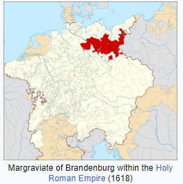
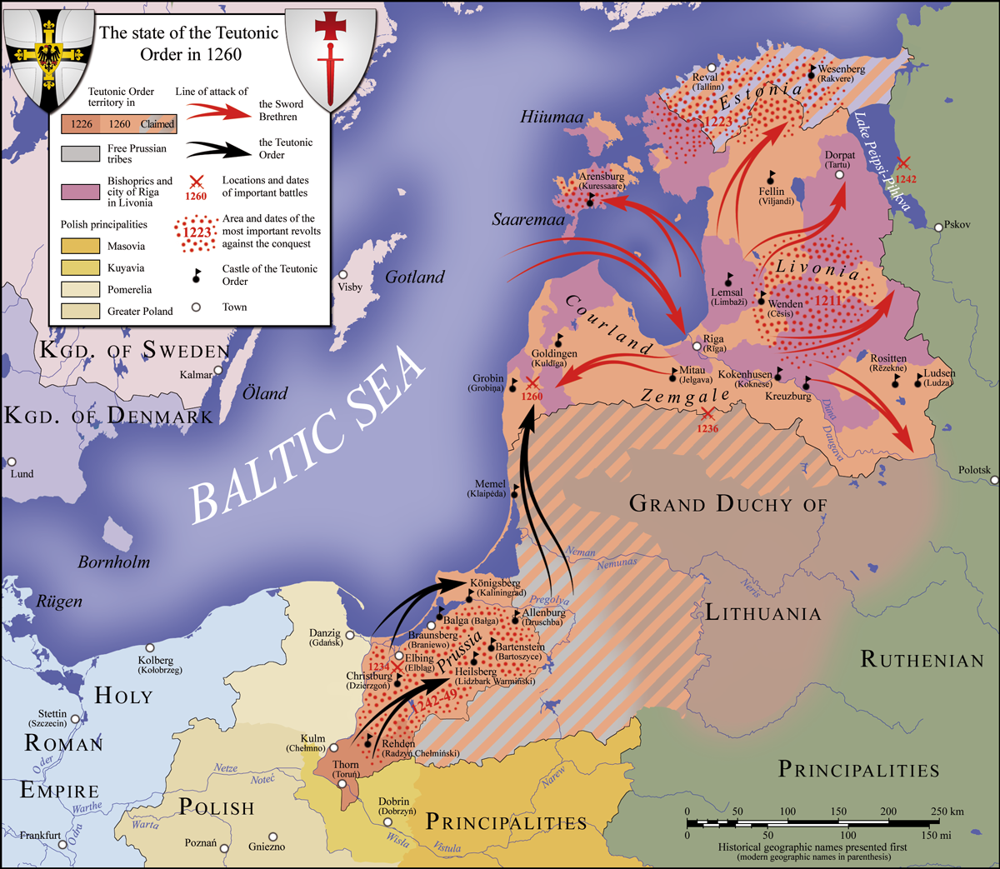
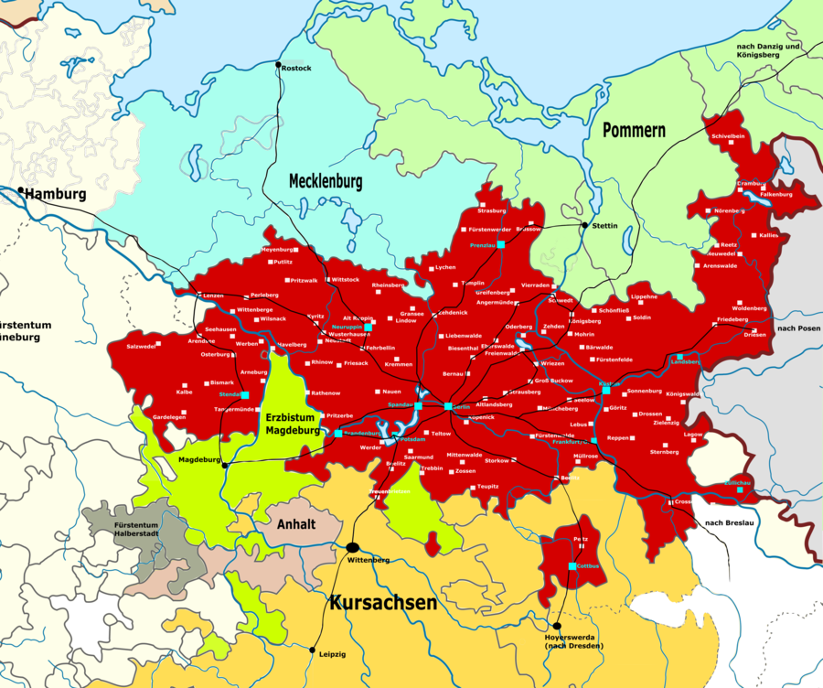
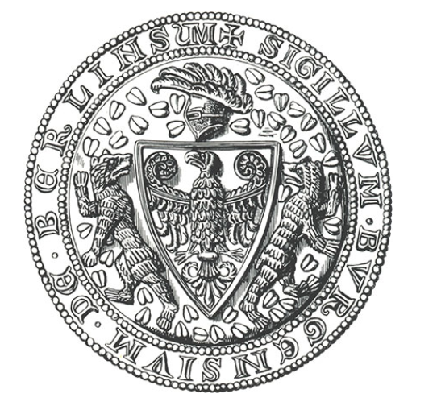
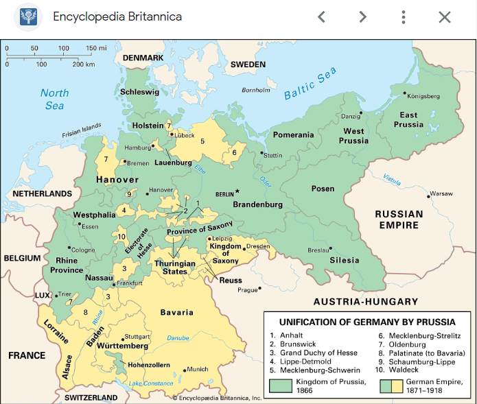
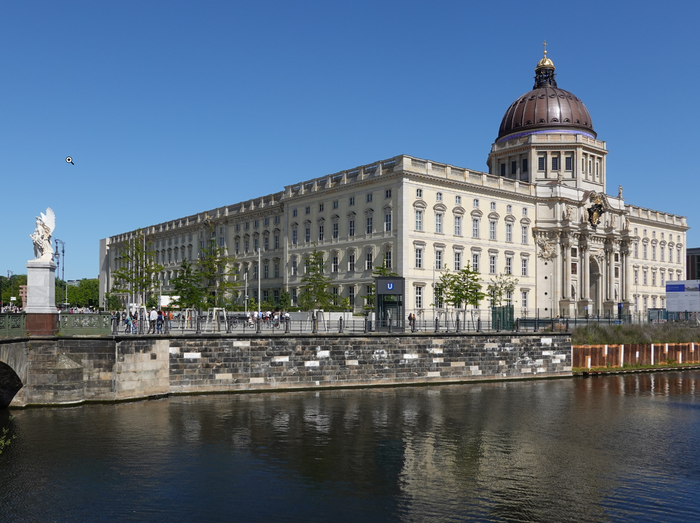
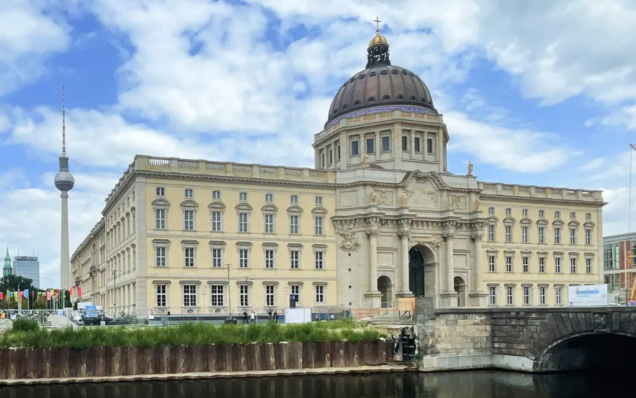
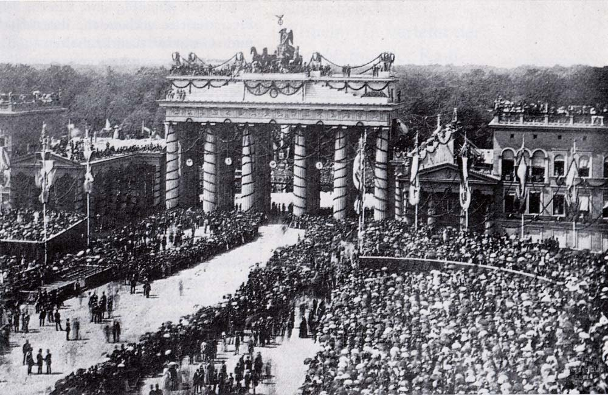

```{r setup, include=FALSE}
knitr::opts_chunk$set(echo = FALSE)
```

## 

-   Das Thema "Preußisches Berlin" ist komplex, und die Aufgabe, es
    zusammenzufassen, scheint unmöglich.

-   Die preußische Geschichte wird in verschiedenen Zeiten präsentiert,
    um einen Einblick in die Entwicklung der Stadt innerhalb ihres
    historischen Kontextes zu geben.

-   In der frühen mittelalterlichen Zeit war die Region Brandenburg Teil
    des Heiligen Römischen Reiches und von slawischen Stämmen bewohnt.

    {width="474"}

#### **Abbildung 1. Region Brandenburg war Teil des Heiligen Römischen Reiches**.

\newpage  

## **Der Deutsche Orden**  
-   Der Deutsche Orden spielte eine bedeutende Rolle bei der
    territorialen Expansion der Markgrafschaft Brandenburg.

    

#### **Abbildung 2. Deutsche Orden**  

<br>  




<br>

#### **Abbildung 3. Mark Brandenburg 1648**

\newpage  

## **Die Gründung der Stadt Berlin**

-   Berlin wurde im Jahr 1237 gegründet und das Wort "Berlin" stammt
    wahrscheinlich von der proto-slawischen Wurzel "berl-", was "Bär"
    bedeutet.

    


**Abbildung 4. Berlin war in 1237 Gegrüunded: Wappen der Stadt Berlins 1280**.

\newpage  

## **Das Haus Hohenzollern**

-   Das Haus Hohenzollern übernahm im Jahr 1415 das Kurfürstentum
    Brandenburg und begann die Hohenzollern-Herrschaft.

-   Berlin wurde im Jahr 1417 zur Hauptstadt und zum Verwaltungszentrum
    der Mark Brandenburg.

-   Die Hohenzollern-Dynastie erweiterte ihre Gebiete durch strategische
    Heiraten, Käufe und Erbschaften.

<!-- -->

-   Preußen wuchs im 18. und 19. Jahrhundert und bildete die Grundlage
    des Deutschen Kaiserreichs.

 
## **Vereignten Deutschen Reiches**  

#### **Abbildung 5. Preussen 1900**.

-   Berlin wurde zur Hauptstadt des Königreichs Preußen und spielte eine
    entscheidende Rolle in der Geschichte Preußens.  
    

\newpage  

## **Preu&szlig;en als eignenst&auml;ndige Einheit**    

-   Friedrich Wilhelm, der Große Kurfürst, regierte Brandenburg-Preußen
    und führte bedeutende Verwaltungs-, Militär- und Wirtschaftsreformen
    durch.  
    
-   Fredrich Wilhelm erweiterte und befestigte Berlin, baute das
    Berliner Stadtschloss und machte Berlin zum Hauptwohnsitz.


#### **Abbildung 6. Friedrich Wilhelm von Brandenburg, der Große Kurfürst**


<!-- -->  

\newpage 

## **Berliner Stadschloss**  

-     

#### **Abbildung 7. Berliner Stadtschloss**.

<!-- -->

-   Das Berliner Stadtschloss wurde im Zweiten Weltkrieg zerstört, aber
    das Humboldt Forum wurde an derselben Stelle wiederaufgebaut.

    

#### **Abbildung 8. Humbolt Forum und Staatliches Museum**.  

-   Preußen spielte eine entscheidende Rolle bei der deutschen Einigung
    und der Bildung des Deutschen Kaiserreichs.

-   Preußen verlor seine Monarchie nach dem Ersten Weltkrieg und wurde
    1947 aufgelöst.  
    
    
\newpage  
    
## **Das Brandenburger Tor**  

-   Das Brandenburger Tor wurde 1791 fertiggestellt und steht symbolisch
    für Freiheit, Demokratie und Menschenrechte.

    

#### **Abbildung 9. Brandenburger Tor im in 1871 Nach dem Deutsch-Französischen Krieg**.

-   Prußen hat einen tiefen Einfluss auf die europäische Geschichte
    hinterlassen und sein Erbe wird in der Geschichte Deutschlands und
    Europas weiterhin untersucht und in Erinnerung behalten.

\newpage


**Wortschatz** 

widmen - devote  

uberwiegend heidnich - presominately pagen  

Margraffen (pl) - Eng. Margrave; hereditary nobleman of authority who defends territory  

nach und nach - step by step  

Erbshaften - Inheritances  

adligen Herrscher - noble ruler regiert - ruled

Kreuzzuge - Crusades

einheimischen - local/native

rerieten unter die Kontrolle - fell under the control

strebte - strived

erschlossenen Gebieten Bauernhofe - opened up, developed

Landzuschuschussen - Land Grants

erlangte das Haus - obtained the house

adligen - nobility

Adelsfamilie - family of nobility

leitete ihren Name Derived their name

er loste den Orden auf = auflosen = Herzogtum - ruled by a Duke

kurfrust - Electorate

```{r echo=FALSE}
knitr::knit_exit()
```

Acprussianmap2.gif
<https://en.wikipedia.org/wiki/Margraviate_of_Brandenburg#/media/File:Acprussiamap2.gif>

Karte_Mark_Brandenburg_1320.pn Margraviate of Brandenburg within the
Holy Roman Empire (1618)
<https://en.wikipedia.org/wiki/Margraviate_of_Brandenburg>

1024px-Central_Europe_religions_1618.jpg
<https://en.wikipedia.org/wiki/Margraviate_of_Brandenburg#/media/File:Central_Europe_religions_1618.jpg>

Karte_Mark_Brandenburg_1320.png
<https://en.wikipedia.org/wiki/Margraviate_of_Brandenburg#/media/File:Karte_Mark_Brandenburg_1320.png>

Teutonic_Order_1260.png
<https://en.wikipedia.org/wiki/Teutonic_Order#/media/File:Teutonic_Order_1260.png>

900px-Straßennetz_und_Städte_Mark_Brandenburg_1648.png
\<<https://www.google.com/search?q=Mark+brandenburg+1417&sxsrf=APwXEdfyzmqAzaSKntM7ucMJV1VLZrtgVw%3A1687029829277&ei=RQiOZPXGELGqqtsPw72t0AU&ved=0ahUKEwi1_cvtg8v_AhUxlWoFHcNeC1oQ4dUDCBA&uact=5&oq=Mark+brandenburg+1417&gs_lcp=Cgxnd3Mtd2l6LXNlcnAQAzIFCCEQoAEyBQghEKABOgcIIxCKBRAnOggILhCKBRCRAjoLCC4QigUQ1AIQkQI6CwgAEIAEELEDEIMBOhEILhCABBCxAxCDARDHARDRAzoNCAAQigUQsQMQgwEQQzoOCC4QigUQxwEQrwEQkQI6CgguEIAEEBQQhwI6CggAEIAEEBQQhwI6CwguEIAEELEDENQCOgcILhCKBRBDOhAILhCABBAUEIcCELEDEIMBOhAIABCABBAUEIcCELEDEIMBOgsILhDUAhCxAxCABDoFCAAQgAQ6BAgjECc6CAgAEIoFEJECOgcIABCKBRBDOgsILhCABBCxAxCDAToFCC4QgAQ6EwguEIAEEBQQhwIQsQMQgwEQ1AI6DQguEIAEEBQQhwIQsQM6CwguEIAEEMcBEK8BOggILhCABBCxAzoKCAAQgAQQsQMQCjoQCC4QgAQQFBCHAhDHARCvAToKCC4QFBCHAhCABDoICC4QgAQQ1AI6GAguEBQQhwIQgAQQlwUQ3AQQ3gQQ4AQYAToWCC4QgAQQ1AIQlwUQ3AQQ3gQQ4AQYAToGCAAQFhAeOggIABCKBRCGA0oECEEYAFAAWNwnYOEqaABwAXgAgAHqBIgBu0KSAQswLjIuMS43LjMuN5gBAKABAcABAdoBBggBEAEYFA&sclient=gws-wiz-serp#imgrc=Pua2YQb8EVeeLM&ip=1>\>

Preussen_1900.png
\<<https://www.google.com/search?q=Preussen+1900&sxsrf=APwXEdeVznXAV4hBjfUxDps5tm9-GryZ1Q%3A1687029887394&ei=fwiOZI7PF7e3qtsPnY6r4As&ved=0ahUKEwjOiqeJhMv_AhW3m2oFHR3HCrwQ4dUDCBA&uact=5&oq=Preussen+1900&gs_lcp=Cgxnd3Mtd2l6LXNlcnAQAzIGCAAQFhAeMgYIABAWEB4yBggAEBYQHjIGCAAQFhAeMgYIABAWEB4yBggAEBYQHjIGCAAQFhAeMggIABCKBRCGAzIICAAQigUQhgMyCAgAEIoFEIYDOggIABCKBRCRAjoFCC4QgAQ6BQgAEIAEOgcIABCABBAKSgQIQRgAUABYtxlgjlNoAHABeAGAAekJiAGSJ5IBCTQtMS4xLjIuMpgBAKABAcABAQ&sclient=gws-wiz-serp#imgrc=yAoy-917mrG8OM>\>

Friedrich Wilhelm von Brandenburg, der Große Kurfürst
\<<https://en.wikipedia.org/wiki/Frederick_William,_Elector_of_Brandenburg#/media/File:Kurf%C3%BCrst_Friedrich_Wilhelm_von_Brandenburg_4.jpeg>\>

Berliner_stadtsschloss.png
<https://upload.wikimedia.org/wikipedia/commons/9/92/Berlin-BerlinerSchloss-2-Asio_%28cropped%29.JPG>

Brandenburger Tor:
\<<https://en.wikipedia.org/wiki/Brandenburg_Gate#/media/File:Brandenburger_tor_1871.jpg>\>
